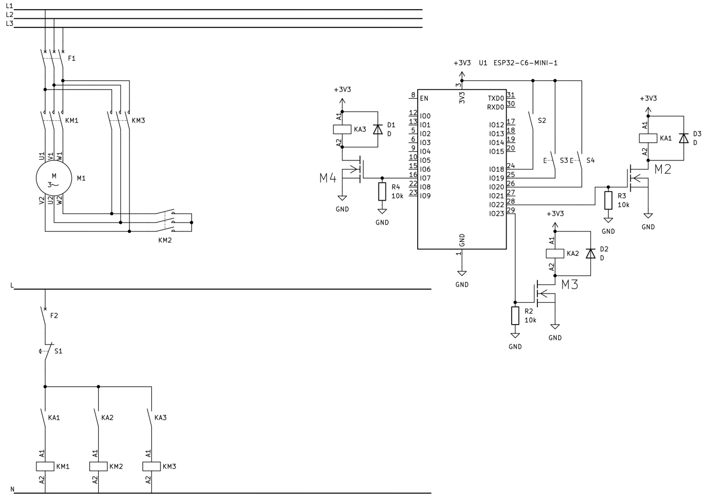

# Star-Delta Three-Phase Motor Starter (ESP32-C6)

A Star-Delta motor starter based around an ESP32-C6. Written in Arduino C++ using PlatformIO in VSCode. The schematic was designed in KiCad using my own IEC-60617 symbol library.

---

## Story

I originally started this project because I wanted to simulate contactor logic. Real contactors are pretty expensive, so I thought it’d be a fun challenge to recreate the Star-Delta starting sequence entirely in code using cheap components. I wrote the code, tested it on a breadboard using LEDs, and then let the project sit and collect dust for a few months.

Fast forward a bit, I came back to it because I wanted to practice drawing electrical schematics in KiCad, combining microcontroller logic with power and control circuits. 

While writing up this repository and reviewing my final KiCad drawing, I had a sudden epiphany: I had drawn contactors right back into the control circuit anyway, despite trying hard to avoid them in the first place. Turns out I built an overengineered microcontroller contactor setup.

Even though the final design ended up being completely redundant, it was still a great way to practice writing clean code, drawing electrical schematics and going over basics related to electronics.

---

## Schematic



---

## Code (`main.cpp`)

```cpp
#include <Arduino.h>
#include <Adafruit_NeoPixel.h>

#define RGB_PIN 8
#define NUM_LEDS 1
#define C_PSU 18
#define Start 19
#define Stop 20
#define contactor_Relay 22
#define Star 23
#define Delta 15

Adafruit_NeoPixel led(NUM_LEDS, RGB_PIN, NEO_GRB + NEO_KHZ800);
unsigned long starStartTime = 0;
bool starRunning = false;

// RGB LED function
void setLED(int r, int g, int b) {
  led.setPixelColor(0, led.Color(r, g, b));
  led.show();
}

// Off function
void off() {
  digitalWrite(Delta, LOW);
  digitalWrite(contactor_Relay, LOW);
  digitalWrite(Star, LOW);
  starRunning = false;
}

// Star control function
void starOn() {
  if (digitalRead(Delta) == 0 && !starRunning) {
    digitalWrite(contactor_Relay, HIGH);
    digitalWrite(Star, HIGH);
    starStartTime = millis();
    starRunning = true;
  }
}

// Delta control function
void deltaOn() {
  if (starRunning && digitalRead(Delta) == 0) {
    digitalWrite(Star, LOW);
    starRunning = false;
    digitalWrite(Delta, HIGH);
  }
}

void setup() {
  pinMode(C_PSU, INPUT_PULLDOWN);
  pinMode(Start, INPUT_PULLDOWN);
  pinMode(Stop, INPUT_PULLDOWN);
  pinMode(contactor_Relay, OUTPUT);
  pinMode(Star, OUTPUT);
  pinMode(Delta, OUTPUT);
  led.setBrightness(2); // LED brightness %
}

void loop() {
  delay(1);
  if (digitalRead(C_PSU) == 0) {
    off();
    setLED(255, 0, 0);
  }
  if (digitalRead(C_PSU) == 1 && !starRunning && digitalRead(Delta) == 0) {
    setLED(255, 255, 0);
  }
  if (digitalRead(Stop) == 1) {
    off();
  }
  if (digitalRead(Start) == 1 && !starRunning && digitalRead(Delta) == 0) {
    starOn();
    setLED(0, 255, 255);
  }
  if (starRunning && millis() - starStartTime >= 2000){
    deltaOn();
    setLED(0, 255, 0);
  }
}
